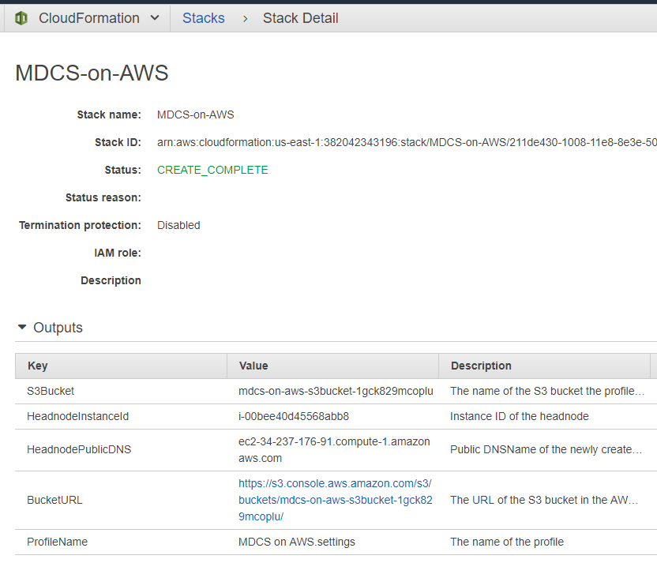
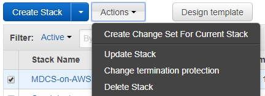

# MATLAB Parallel Server  on Amazon Web Services

## Step 1. Launch the Template

Click the **Launch Stack** button for your desired region below to deploy the cloud resources on AWS. This will open the AWS console in your web browser.

| Region | Launch Link |
| --------------- | ----------- |
| **us-east-1** |  |
| **eu-west-1** |  |

## Step 2. Configure the Cloud Resources
After you click the Launch Stack button above, the “Create stack” page will open in your browser where you can configure the parameters. It is easier to complete the steps if you position these instructions and the AWS console window side by side.

1. Specify a stack name. This will be shown in the AWS CloudFormation console and must be unique within the AWS account.

2. Specify and check the defaults for these resource parameters:

| Parameter label | Description |
| --------------- | ----------- |
| **VPC to deploy this stack to** | ID of an existing VPC in which to deploy this stack |
| **Subnets for the head node and worker nodes** | List of existing subnets IDs for the head node and workers |
| **CIDR IP address range of client** | The IP address range that will be allowed to connect to this cluster from outside of the VPC. This field should be formatted as \<ip_address>/\<mask>. E.g. 10.0.0.1/32. This is the public IP address which can be found by searching for 'what is my ip address' on the web. The mask determines the number of IP addresses to include. A mask of 32 is a single IP address. This calculator can be used to build a specific range: https://www.ipaddressguide.com/cidr. You may need to contact your IT administrator to determine which address is appropriate. |
| **Name of SSH key** | The name of an existing EC2 KeyPair to allow SSH access to all the instances. See https://docs.aws.amazon.com/AWSEC2/latest/UserGuide/ec2-key-pairs.html for details on creating these. |
| **Cluster name** | A name to use for this cluster. This name will be shown in MATLAB as the cluster profile name. |
| **Instance type for the head node** | The AWS instance type to use for the head node, which will run the job manager. No workers will be started on this node, so this can be a smaller instance type than the worker nodes. See https://aws.amazon.com/ec2/instance-types for a list of instance types. Must be available in the Availability Zone of the first subnet in the configured list |
| **InstanceAmiCustom** | Custom Amazon Machine Image (AMI) in the target region |
| **Size (GB) of the database EBS volume** | The size in GB of the EBS volume to use for the database. All job and task information, including input and output data will be stored on this volume and should therefore have enough capacity to store the expected amount of data. If this parameter is set to 0 no volume will be created and the root volume of the instance will be used for the database. |
| **Instance type for the worker nodes** | The AWS instance type to use for the workers. See https://aws.amazon.com/ec2/instance-types for a list of instance types. |
| **Number of worker nodes** | The number of AWS instances to start for the workers to run on. |
| **Number of workers to start on each node** | The number of MATLAB workers to start on each instance. Specify 1 worker for every 2 vCPUs, because this results in 1 worker per physical core. For example an m4.16xlarge instance has 64 vCPUs, so can support 32 MATLAB workers. See https://aws.amazon.com/ec2/instance-types for details on vCPUs for each instance type. |
| **License Manager for MATLAB connection string** | Optional License Manager for MATLAB string in the form \<port>@\<hostname>. If not specified, online licensing is used. If specified, the license manager must be accessible from the specified VPC and subnets. If the Network License Manager for MATLAB was deployed using the reference architecture, this can be achieved by specifying the security group of that deployment as the AdditionalSecurityGroup parameter. |
| **Additional security group to place instances in** | The ID of an additional (optional) Security Group for the instances to be placed in. Often the License Manager for MATLAB's Security Group. |

3. Tick the box to accept that the template uses IAM roles. These roles allow:
  * the instances to transfer the shared secret information between the nodes, via the S3 bucket, to establish SSL encrypted communications
  * the instances to write the cluster profile to the S3 bucket for secure access to the cluster from the client MATLAB
  * a custom lambda function to delete the contents of this S3 bucket when the stack is deleted

4. Click the **Create** button.

When you click Create, the cluster is created using AWS CloudFormation templates.

## Step 3: Connect to Your Cluster From MATLAB

1. After clicking **Create** you will be taken to the Stack Detail page for your Stack. Wait for the Status to reach **CREATE\_COMPLETE**. This may take up to 10 minutes.
2. Select **Outputs**.

    

3. Click the link next to **BucketURL** under **Outputs**.
4. Select the profile (**ClusterName.settings**) and click **Download**.
5. Open MATLAB.
6. In the Parallel drop-down menu in the MATLAB toolstrip select **Create and Manage Clusters...**.
7. Click **Import**.
8. Select the downloaded profile and click open.
9. Click **Set as Default**.
10. (Optional) Validate your cluster by clicking the **Validate** button.

After setting the cloud cluster as default, the next time you run a parallel language command (such as `parfor`, `spmd`, `parfeval` or `batch`) MATLAB connects to the cluster. The first time you connect, you will be prompted for your MathWorks account login. The first time you run a task on a worker it will take several minutes for the worker MATLAB to start. This delay is due to initial loading of data from the EBS volumes. This is a one-time operation, and subsequent tasks begin much faster.

Your cluster is now ready to use. It will remain running after you close MATLAB. Delete your cluster by following the instructions below.

**NOTE**: Use the profile and client IP address range to control access to your cloud resources. Anyone with this file can connect to your resources from a machine within the specified IP address range and run jobs on it.

# Additional Information

## Delete Your Cloud Resources

You can remove the CloudFormation stack and all associated resources when you are done with them. Note that there is no undo. After you delete the cloud resources you cannot use the downloaded profile again.

1. Select the Stack in the CloudFormation Stacks screen.  Select **Actions/Delete**.

     

2. Confirm the delete when prompted.  CloudFormation will now delete your resources which can take a few minutes.

## Troubleshooting

If your stack fails to create, check the events section of the CloudFormation console. It will indicate which resources caused the failure and why.

If the stack created successfully but you are unable to validate the cluster check the logs on the instances to diagnose the error. The logs are output to /var/log on the instance nodes; the files of interest are cloud-init.log, cloud-init-output.log, mathworks.log and all the logs under /var/log/mdce.
